

# Lab1 Infrastructure setup

## 1. Set-up account

I created a Free Tier AWS Account with $180 of free credits.
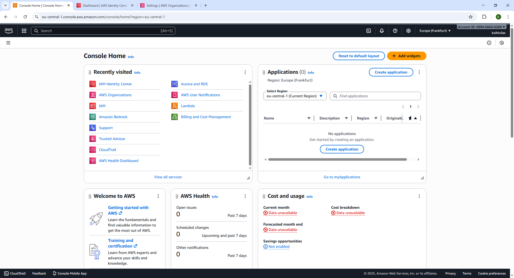

## 2b. Create an IAM IC account and Organization

Created an IAM Identity Center account with full admin access.
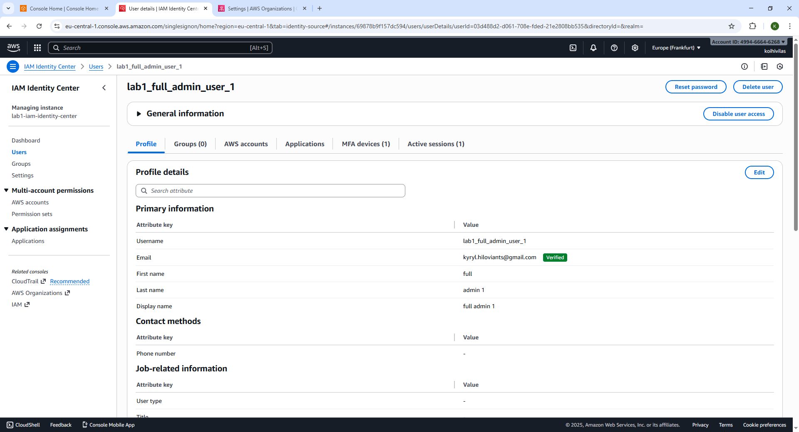
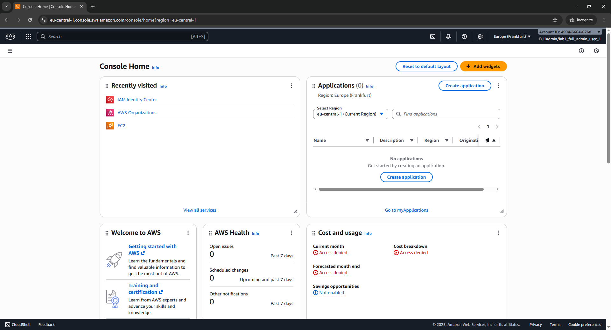

And also created an Organization.
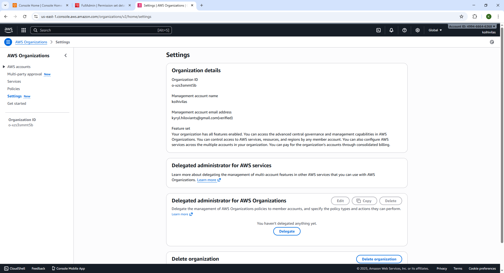

## 3-4. Create view-only user (IAM - for instances) with assumed role
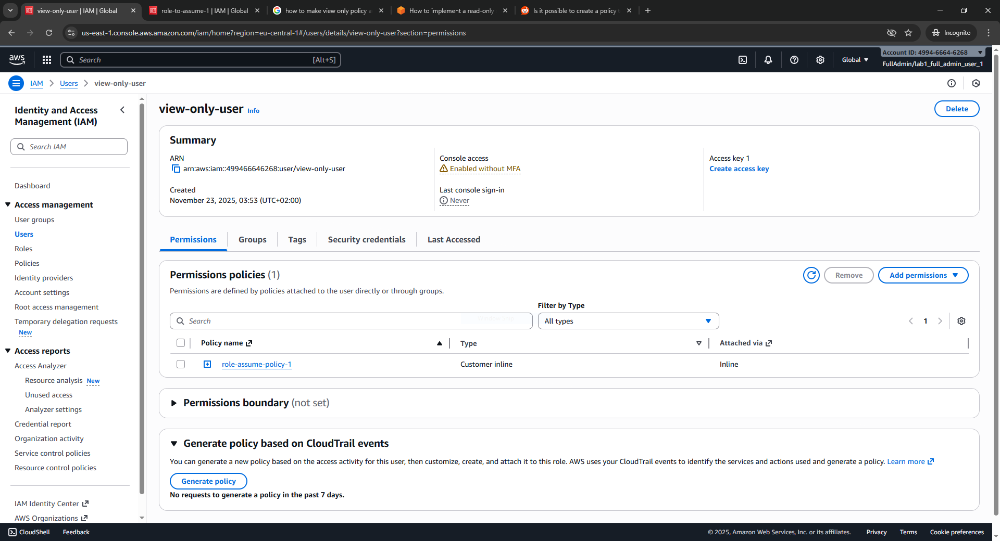 
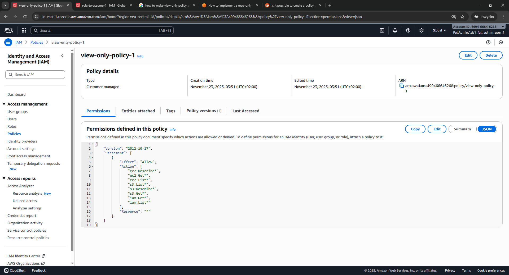 
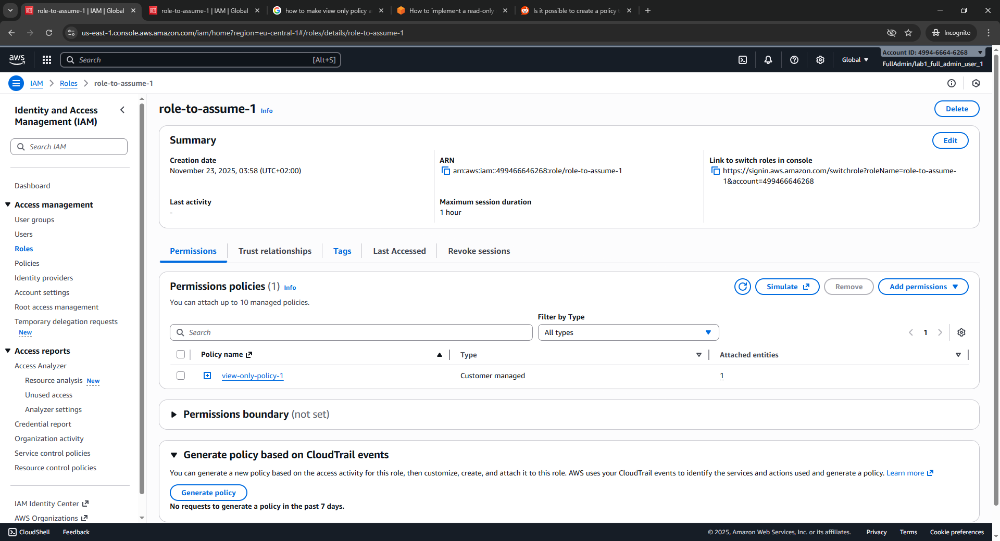 
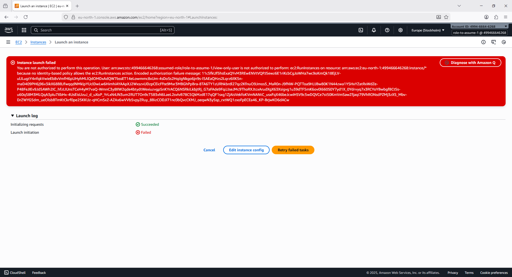

## 5. Create Cloudformation template for IAM policy and role
I auto-generated Cloudformation template for IAM policy and role [iam-role-policy-template-1763864000957.yaml](iam-role-policy-template-1763864000957.yaml).
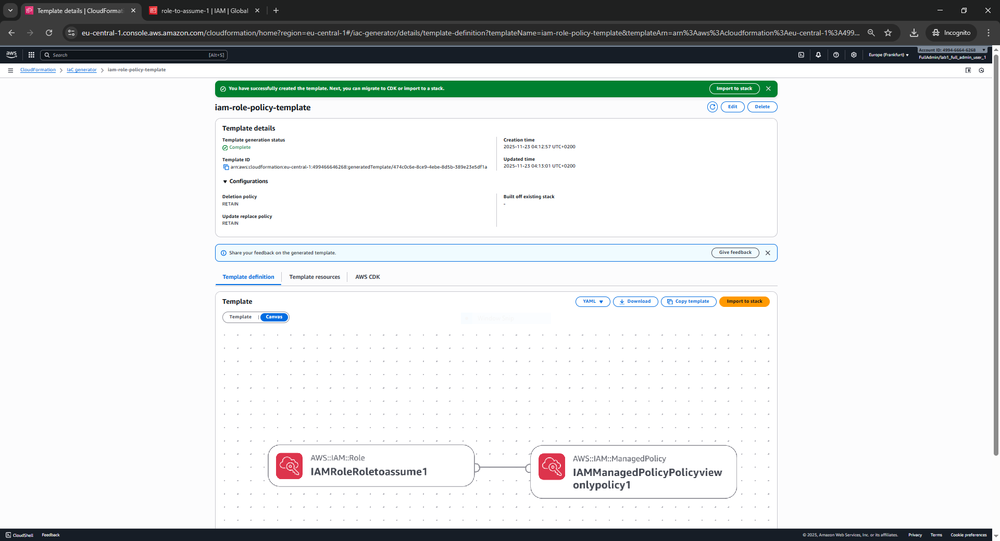

## 6. VPC
Created VPC according to the task
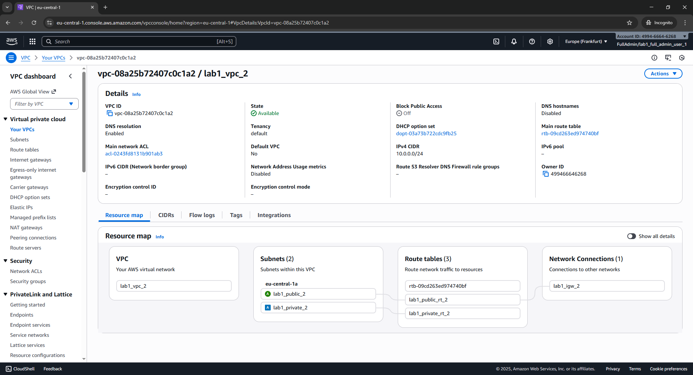

## 7. IaC stack with network resources
Auto-generated Cloudformation template for network resources [lab1-vpc-template-1763857369908.yaml](lab1-vpc-template-1763857369908.yaml).
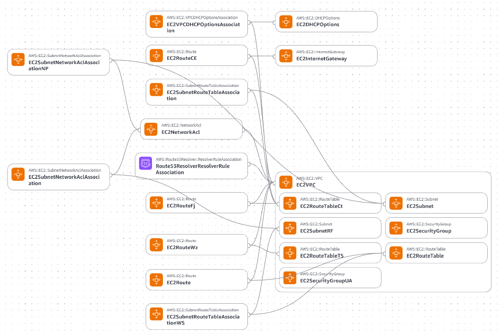

## 8. Monthly budget
As I understand two shards will need 2 computing units + coordinator unit. 
I would probably use 3 t3.micro with on-demand plan with 100% utilization which AWS pricing calculator
calculated as the following:
* 3 instances x 0.012 USD On Demand hourly cost x 730 hours in a month = 26.280000 USD
* On-Demand instances (monthly): 26.280000 USD
---
Plus using 3 instances of EBS with 8 GB each would cost:
* 2,190 total EC2 hours / 730 hours in a month = 3.00 instance months
* 8 GB x 3.00 instance months x 0.0952 USD = 2.28 USD (EBS Storage Cost)
* Amazon Elastic Block Store (EBS) total cost (monthly): 2.28 USD
---
So total would be **28.56 USD**
